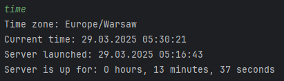

# My notifications app

A simple notifications application in client-server architecture written in Java.

## Contents
- [Server application](#server-application)
  - [Server welcome message](#server-welcome-message)
  - [Server info](#server-info)
  - [Print server time statistics](#print-server-time-statistics)
  - [List all connected clients](#list-all-connected-clients)
  - [List all queued requests](#list-all-queued-requests)
  - [Sample server logs](#sample-server-logs)
  - [Server shutdown](#server-shutdown)
- [Client application](#client-application)
  - [Main menu](#main-menu)
  - [Sending notification](#sending-notification)
  - [Show notifications history](#show-notifications-history)
- [Version](#version)
- [Author](#author)

## Server application
Server accepts requests from clients, then the requests are queued and resend to clients at desired time.
### Server welcome message

### Server info

### Print server time statistics

### List all connected clients

### List all queued requests

### Sample server logs

### Server shutdown

## Client application
Client can send notification request to server in following format:
 
message_content
 
dd:MM:yyyy HH.mm.ss

### Main menu

### Sending notification

### Show notifications history
Client can see all its previously received notifications and also clear it

  

## Version
1.0.0

## Author
Jakub Jagodziński
